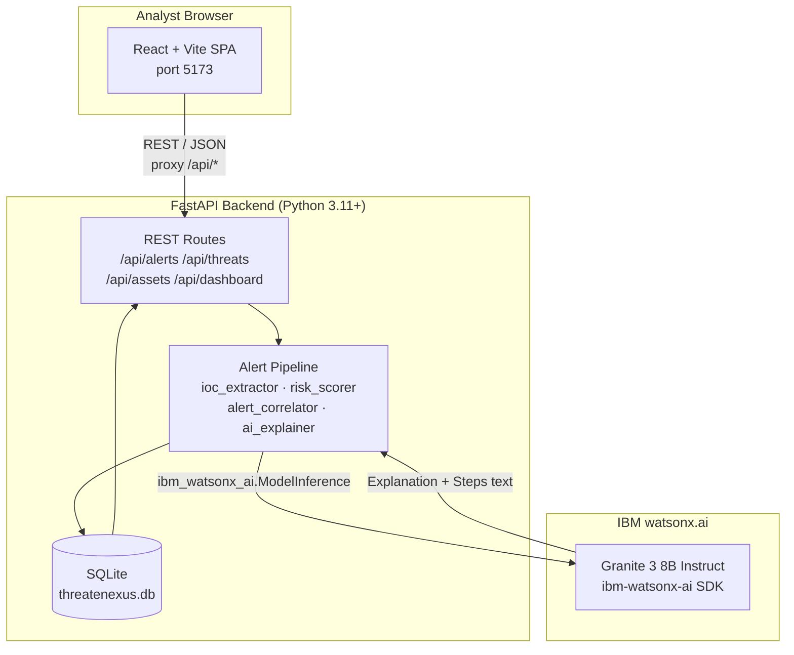

# Architecture

## System Architecture

ThreatNexus follows a classic three-tier architecture: React SPA → FastAPI REST backend → SQLite database,
with an optional IBM watsonx.ai call at alert-ingest time.

## Components

| Component | Technology | Responsibility |
|---|---|---|
| Frontend | React 18 + Vite + TypeScript | SOC dashboard: alert queue, risk chart, IOC chips, detail panel |
| Backend API | FastAPI (Python 3.11) | REST endpoints, request routing, response serialisation |
| Alert Pipeline | Python services | IOC extraction, threat-intel lookup, risk scoring, correlation, AI explanation |
| AI / ML | IBM watsonx.ai — Granite 3 8B Instruct | Threat explanation generation and investigation step recommendations |
| Database | SQLite (SQLAlchemy ORM) | Persistent store for assets, threat intel, and enriched alerts |

## Data Flow

1. An alert arrives at `POST /api/alerts/ingest` (from a SIEM, script, or the Postman demo collection).
2. The **IOC extractor** scans the alert text with regex patterns and returns a typed list of indicators (IP, domain, URL, hash, email).
3. Each IOC is looked up in the **threat intel table** — matching records contribute a reputation score and threat category.
4. The **asset resolver** finds the affected host by hostname and retrieves its criticality score (1–10).
5. The **risk scorer** applies the weighted formula (source severity 20%, IOC reputation 35%, asset criticality 25%, behaviour 10%, correlation 10%) and produces a score 0–100 mapped to LOW/MEDIUM/HIGH/CRITICAL.
6. The **alert correlator** queries recent alerts for shared IOCs or the same asset within a 4-hour window and assigns a shared `correlation_group_id` if a match is found.
7. The **AI explainer** calls IBM watsonx.ai with a structured prompt and receives a plain-English explanation and 4 investigation steps; falls back to a template if credentials are absent.
8. The enriched alert is committed to SQLite and returned to the caller.
9. The React dashboard polls `/api/alerts/` and `/api/dashboard/stats`, rendering the prioritised queue in real time.

## Security Considerations

- API keys and credentials are stored exclusively in `.env` — the `.env` file is in `.gitignore` and never committed.
- The `.env.example` template documents every required variable without exposing real values.
- SQLite is scoped to the local filesystem; no network-accessible database in the demo configuration.
- CORS is locked to `localhost:5173` and `localhost:3000` — not wildcard.
- IOC extraction explicitly excludes RFC-1918 private IP ranges to reduce false-positive noise.

## Scalability Notes

The hackathon implementation uses SQLite for zero-dependency setup. A production deployment would:

- Replace SQLite with PostgreSQL behind a connection pool (asyncpg / SQLAlchemy async).
- Move the alert pipeline to a task queue (Celery + Redis) so heavy watsonx.ai calls are asynchronous.
- Add Redis caching for threat-intel lookups (IOC reputation rarely changes within minutes).
- Deploy the FastAPI backend as a horizontally scalable container behind an NGINX load balancer.
- Stream real-time alert updates to the frontend via WebSocket instead of polling.
