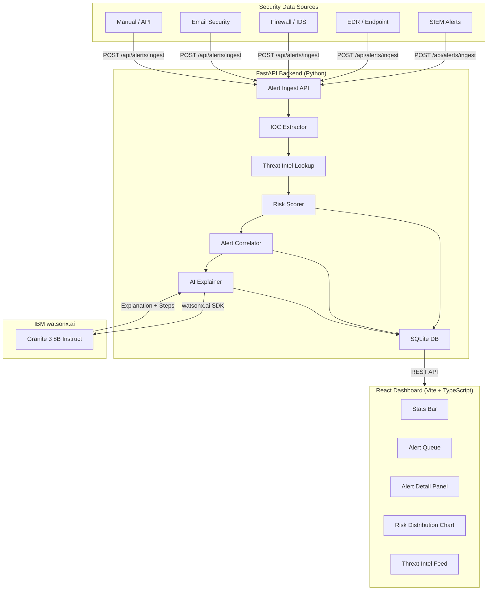

# Solution Overview

## What We Built

ThreatNexus is an AI-assisted threat intelligence and alert prioritisation platform. It ingests security
alerts from any source, automatically enriches them with IOC extraction and threat intelligence lookups,
calculates a contextual risk score from 0–100, correlates related events into attack stories, and generates
a plain-English explanation of why each alert is dangerous — all served through a real-time SOC dashboard.

The result is a **ranked queue**: the analyst sees 🔴 CRITICAL at the top, and 🟢 LOW at the bottom,
with evidence and investigation steps already prepared.

## How It Works

1. **Alert Ingestion** — An alert arrives via the REST API (`POST /api/alerts/ingest`) from any security tool,
   SIEM, or simulated source. The payload contains a title, description, source severity, and optionally a raw log line.

2. **IOC Extraction** — A regex-based parser scans the alert text for Indicators of Compromise:
   IP addresses (excluding RFC-1918 private ranges), domains, URLs, MD5/SHA1/SHA256 file hashes,
   and email addresses. All extracted IOCs are stored with the alert.

3. **Threat Intelligence Enrichment** — Each extracted IOC is looked up in the threat intelligence database.
   Matching records contribute a reputation score (0–100) and a threat category (e.g. `ransomware`, `c2`, `phishing`).

4. **Asset Context** — If the alert references a known hostname, the platform retrieves the asset's criticality
   score (1–10) from the asset registry. A domain controller with criticality 10 produces a higher final score
   than a lobby camera with criticality 3, even for the same raw alert.

5. **Risk Scoring** — A weighted formula combines five signals into a final score:

   | Signal | Weight | Description |
   |---|---|---|
   | Source Severity | 20% | Raw severity from the originating tool |
   | IOC Reputation | 35% | Highest reputation score among matched IOCs |
   | Asset Criticality | 25% | Scaled 1–10 → 0–100 |
   | Threat Category Behaviour | 10% | Category-specific suspicion bonus |
   | Correlation Bonus | 10% | Flat bonus if part of a correlated group |

   Scores map to: 0–34 = 🟢 LOW · 35–59 = 🟡 MEDIUM · 60–79 = 🟠 HIGH · 80–100 = 🔴 CRITICAL

6. **Alert Correlation** — The platform searches recent alerts (within a 4-hour window) for shared IOCs or
   the same affected asset. Related alerts are grouped under a `correlation_group_id`, making multi-stage
   attack campaigns visible as a single storyline rather than scattered individual events.

7. **AI Explanation** — IBM watsonx.ai (Granite model) generates a 2–3 sentence plain-English explanation
   of why the alert is dangerous and 4 concrete investigation steps. When watsonx.ai credentials are not
   configured, a deterministic template produces a useful fallback explanation.

8. **Analyst Dashboard** — The React frontend presents:
   - A stats bar showing total, unacknowledged, and risk-distribution counts
   - A donut chart of the risk distribution
   - The prioritised alert queue (highest risk first), filterable by severity
   - A side panel for each alert with the AI explanation, IOC chips, asset details, and raw log
   - A threat intelligence feed showing the highest-reputation known-bad IOCs

## Architecture Diagram

## Key Design Decisions

| Decision | Rationale |
|---|---|
| SQLite for the hackathon | Zero external dependencies — the whole platform runs with `pip install` and `npm install`. Production would use PostgreSQL. |
| Regex IOC extraction (no NLP) | Fast, deterministic, and zero cost. Sufficient for structured log formats. NLP extraction could be added for unstructured text. |
| Weighted risk formula (transparent) | An explainable formula builds analyst trust. Black-box ML scores are rejected in SOC environments because analysts must justify escalations. |
| Graceful watsonx.ai fallback | The platform is fully functional without AI credentials. The template fallback ensures demo reliability. |
| IOC-based correlation (no ML clustering) | Deterministic correlation on shared IOCs and asset proximity is reliable and auditable — important for incident response documentation. |

## IBM Technologies Used

- **IBM watsonx.ai (Granite 3 8B Instruct):** Used via the `ibm-watsonx-ai` Python SDK to generate plain-English threat
  explanations and investigation recommendations from a structured prompt that includes alert metadata, IOC details,
  asset context, and risk score components. The model is called at alert-ingest time and the result is persisted
  with the alert for instant display on the dashboard.
